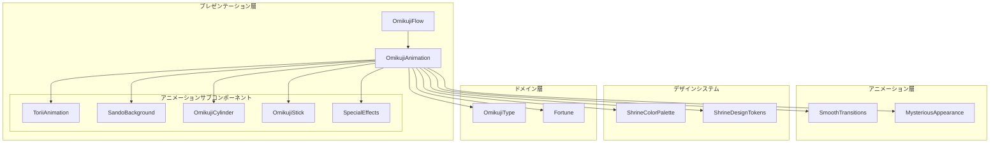
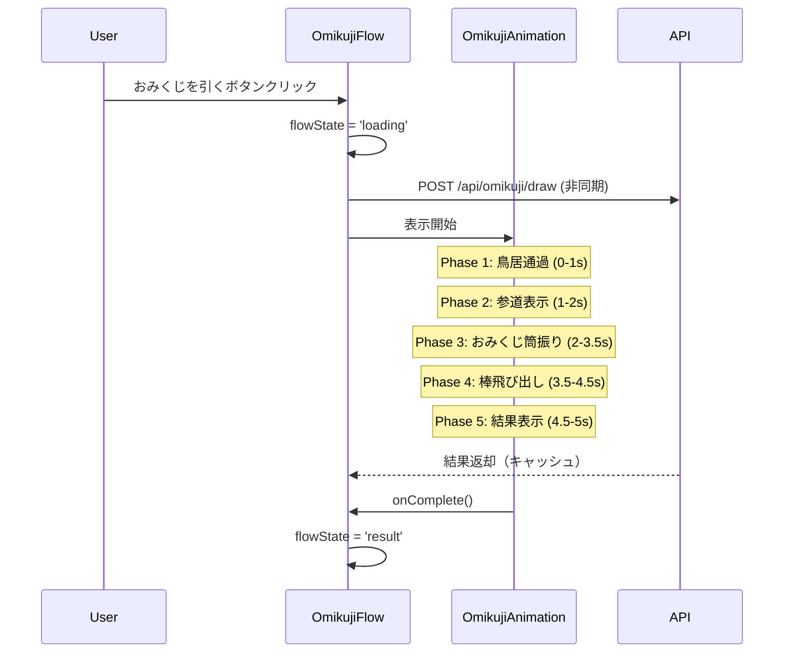
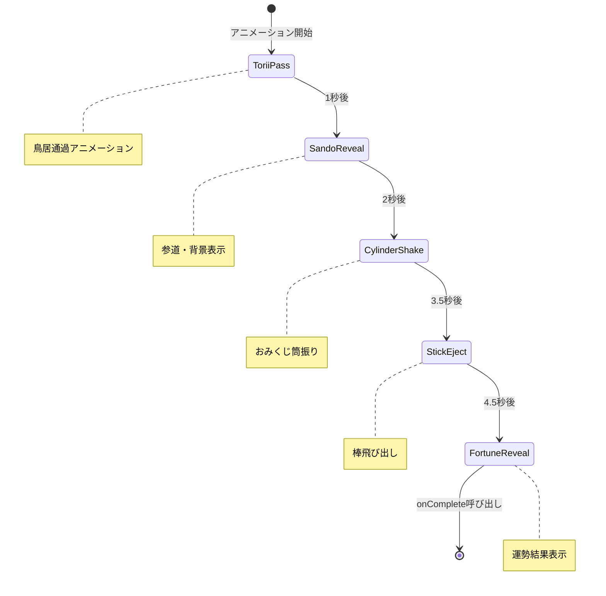

# Design Document: おみくじアニメーション

## Overview

**Purpose**: おみくじを引く際に神社参拝風のアニメーションを表示することで、ユーザーの期待感とエンターテインメント性を高める。

**Users**: おみくじを引くすべてのユーザーが、鳥居通過→参道表示→おみくじ筒振り→棒飛び出し→結果表示のアニメーションシーケンスを体験する。

**Impact**: 既存のOmikujiFlowコンポーネントの'loading'状態を拡張し、OmikujiLoadingIndicatorをOmikujiAnimationに置き換える。

### Goals
- 神社参拝風の没入感のあるアニメーション体験を提供
- おみくじ種類に応じた動的なタイトル・メッセージ表示
- 運勢（大吉/大凶）に応じた特別演出の実装
- 60fps維持とアクセシビリティ（reduced-motion）対応

### Non-Goals
- 音声・効果音の実装（将来的な拡張）
- アニメーションのカスタマイズ機能
- アニメーションスキップ機能（初期実装では非対応）

## Architecture

### Existing Architecture Analysis

既存のOmikujiFlowは以下の状態遷移を持つ:
- `selection` → `transitioning` → `loading` → `result` | `error`

現在の`loading`状態ではOmikujiLoadingIndicatorが表示されている。この状態をOmikujiAnimationに置き換え、アニメーションシーケンスを実行する。

既存のアニメーションシステム（`src/animations/`）と整合性を保ちながら拡張する。

### Architecture Pattern & Boundary Map



**Architecture Integration**:
- Selected pattern: コンポーネント分割パターン（視覚要素をサブコンポーネントに分離）
- Domain/feature boundaries: アニメーションロジックは`src/features/omikuji/components/OmikujiAnimation/`に配置
- Existing patterns preserved: AnimatePresence、Framer Motion variants、既存イージング関数
- New components rationale: 視覚要素の再利用性とテスト容易性のため分離
- Steering compliance: DDD準拠、Framer Motion使用、TypeScript strict mode

### Technology Stack

| Layer | Choice / Version | Role in Feature | Notes |
|-------|------------------|-----------------|-------|
| Frontend | React 19.2.3 | コンポーネント構築 | 既存 |
| Animation | Framer Motion 12.23+ | アニメーションシーケンス | 既存、シーケンス機能活用 |
| Styling | Tailwind CSS 4 | スタイリング | 既存デザインシステムと統合 |
| Design System | ShrineColorPalette, ShrineDesignTokens | 神社テーマのスタイル | 既存 |

## System Flows

### アニメーションシーケンスフロー



### アニメーションフェーズ状態遷移



## Requirements Traceability

| Requirement | Summary | Components | Interfaces | Flows |
|-------------|---------|------------|------------|-------|
| 1.1-1.6 | アニメーションシーケンス | OmikujiAnimation, ToriiAnimation, SandoBackground, OmikujiCylinder, OmikujiStick | OmikujiAnimationProps | アニメーションシーケンスフロー |
| 2.1-2.7 | 視覚的要素 | ToriiAnimation, SandoBackground, StoneLantern, Shimenawa, SakuraPetals, OmikujiCylinder, OmikujiStick | - | - |
| 3.1-3.4 | エンジニア要素 | CodeLogStream, StatusMessage | AnimationTitleConfig | - |
| 4.1-4.5 | 運勢別演出 | SpecialEffects, DaikichiEffect, DaikyoEffect | FortuneEffectProps | - |
| 5.1-5.5 | アニメーション制御 | OmikujiAnimation, useAnimationPhase | OmikujiAnimationProps | - |
| 6.1-6.5 | パフォーマンス・アクセシビリティ | OmikujiAnimation | - | - |
| 7.1-7.5 | 既存システム統合 | OmikujiFlow修正 | - | - |

## Components and Interfaces

| Component | Domain/Layer | Intent | Req Coverage | Key Dependencies | Contracts |
|-----------|--------------|--------|--------------|------------------|-----------|
| OmikujiAnimation | Presentation | アニメーションシーケンス全体を管理 | 1.1-1.6, 5.1-5.5, 6.1-6.5 | Framer Motion (P0), OmikujiType (P0), Fortune (P0) | Props, State |
| ToriiAnimation | Presentation | 鳥居通過アニメーション | 1.1, 2.1 | Framer Motion (P0) | Props |
| SandoBackground | Presentation | 参道・背景・石灯籠・注連縄 | 1.2, 2.2-2.4 | ShrineDesignTokens (P1) | Props |
| SakuraPetals | Presentation | 桜の花びらエフェクト | 2.5, 4.2 | - | Props |
| OmikujiCylinder | Presentation | おみくじ筒振りアニメーション | 1.3, 2.6 | Framer Motion (P0) | Props |
| OmikujiStick | Presentation | おみくじ棒飛び出しアニメーション | 1.4-1.5, 2.7 | Framer Motion (P0), Fortune (P0) | Props |
| CodeLogStream | Presentation | 背景コードログストリーム | 3.1 | - | Props |
| StatusMessage | Presentation | ステータスメッセージ表示 | 3.2-3.4 | OmikujiType (P1) | Props |
| SpecialEffects | Presentation | 運勢別特別演出 | 4.1-4.5 | Fortune (P0) | Props |
| useAnimationPhase | Hook | アニメーションフェーズ状態管理 | 1.1-1.6 | - | Hook API |

### Presentation Layer

#### OmikujiAnimation

| Field | Detail |
|-------|--------|
| Intent | アニメーションシーケンス全体を管理し、各サブコンポーネントを連携させる |
| Requirements | 1.1-1.6, 5.1-5.5, 6.1-6.5 |

**Responsibilities & Constraints**
- アニメーションフェーズの状態管理と遷移制御
- 子コンポーネントへのプロパティ配布
- アニメーション完了時のコールバック呼び出し
- reduced-motion設定の検出と対応

**Dependencies**
- Inbound: OmikujiFlow — アニメーション表示のトリガー (P0)
- Outbound: ToriiAnimation, SandoBackground, OmikujiCylinder, OmikujiStick, SpecialEffects — 視覚要素 (P0)
- External: Framer Motion — アニメーションライブラリ (P0)

**Contracts**: Props [x] / State [x]

##### Props Interface

```typescript
interface OmikujiAnimationProps {
  /** 運勢結果 */
  fortune: Fortune;
  /** おみくじの種類 */
  omikujiType: OmikujiType;
  /** アニメーション完了時のコールバック */
  onComplete: () => void;
  /** ステータスメッセージ配列（オプション） */
  statusMessages?: string[];
}
```

##### State Management

```typescript
type AnimationPhase =
  | 'torii-pass'      // 鳥居通過
  | 'sando-reveal'    // 参道表示
  | 'cylinder-shake'  // おみくじ筒振り
  | 'stick-eject'     // 棒飛び出し
  | 'fortune-reveal'; // 結果表示

interface AnimationState {
  phase: AnimationPhase;
  isComplete: boolean;
  currentMessageIndex: number;
}
```

**Implementation Notes**
- Integration: OmikujiFlowの'loading'状態で表示、OmikujiLoadingIndicatorを置き換え
- Validation: fortune, omikujiType, onCompleteは必須
- Risks: アニメーション時間がパフォーマンスに影響する可能性

---

#### ToriiAnimation

| Field | Detail |
|-------|--------|
| Intent | 鳥居を3D遠近法で通過するアニメーションを表示 |
| Requirements | 1.1, 2.1 |

**Contracts**: Props [x]

```typescript
interface ToriiAnimationProps {
  /** アニメーション開始フラグ */
  isActive: boolean;
  /** 完了時コールバック */
  onComplete: () => void;
  /** 大凶時の暗いスタイル適用 */
  isDaikyo?: boolean;
}
```

**Implementation Notes**
- CSS transform: perspective + translateZ + scaleで奥から手前への通過を表現
- ShrineDesignTokens.architecture.toriiのスタイルを適用
- 約1秒のアニメーション

---

#### SandoBackground

| Field | Detail |
|-------|--------|
| Intent | 神社の参道、石畳、石灯籠、注連縄を表示 |
| Requirements | 1.2, 2.2-2.4 |

**Contracts**: Props [x]

```typescript
interface SandoBackgroundProps {
  /** 表示開始フラグ */
  isVisible: boolean;
  /** 大凶時の暗いスタイル適用 */
  isDaikyo?: boolean;
}
```

**Implementation Notes**
- rotateXで参道の奥行き感を表現
- 石灯籠は左右に配置、flickerアニメーションで灯火を表現

---

#### OmikujiCylinder

| Field | Detail |
|-------|--------|
| Intent | おみくじ筒の振りアニメーションを表示 |
| Requirements | 1.3, 2.6 |

**Contracts**: Props [x]

```typescript
interface OmikujiCylinderProps {
  /** アニメーション開始フラグ */
  isShaking: boolean;
  /** 完了時コールバック */
  onComplete: () => void;
  /** 大凶時の暗いスタイル適用 */
  isDaikyo?: boolean;
}
```

**Implementation Notes**
- rotate + translateYで振りモーションを表現
- 約1.5秒、4回の振りサイクル

---

#### OmikujiStick

| Field | Detail |
|-------|--------|
| Intent | おみくじ棒の飛び出しと運勢表示 |
| Requirements | 1.4-1.5, 2.7 |

**Contracts**: Props [x]

```typescript
interface OmikujiStickProps {
  /** 飛び出しアニメーション開始フラグ */
  isEjecting: boolean;
  /** 表示する運勢 */
  fortune: Fortune;
  /** 大凶時の暗いスタイル適用 */
  isDaikyo?: boolean;
}
```

**Implementation Notes**
- translateY + rotateで棒が飛び出すアニメーション
- 運勢テキストは縦書き（writing-mode: vertical-rl）

---

#### SpecialEffects

| Field | Detail |
|-------|--------|
| Intent | 運勢に応じた特別演出（大吉: 後光オーラ、大凶: 暗い霧・振動） |
| Requirements | 4.1-4.5 |

**Contracts**: Props [x]

```typescript
interface SpecialEffectsProps {
  /** 運勢 */
  fortune: Fortune;
  /** 効果表示開始フラグ */
  isActive: boolean;
}
```

**Implementation Notes**
- 大吉: conic-gradient回転で虹色後光、桜増量
- 大凶: 背景暗転、微振動（transform: translate）、霧オーバーレイ

---

#### CodeLogStream

| Field | Detail |
|-------|--------|
| Intent | 背景にエンジニア風コードログをストリーム表示 |
| Requirements | 3.1 |

**Contracts**: Props [x]

```typescript
interface CodeLogStreamProps {
  /** 大凶時の赤いスタイル適用 */
  isDaikyo?: boolean;
}

const CODE_LOGS: string[] = [
  "git commit -m 'divine fix'",
  "npm install blessings",
  "docker-compose up -d shrine",
  "SELECT fortune FROM spirit_db",
  "while(alive) { pray(); }",
  "sudo systemctl restart fate",
  "const luck = Math.random();",
  "yarn add good-vibes"
];
```

---

#### StatusMessage

| Field | Detail |
|-------|--------|
| Intent | おみくじ種類に応じたタイトルとステータスメッセージを表示 |
| Requirements | 3.2-3.4 |

**Contracts**: Props [x]

```typescript
interface StatusMessageProps {
  /** おみくじの種類 */
  omikujiType: OmikujiType;
  /** 現在のメッセージインデックス */
  currentMessageIndex: number;
  /** カスタムメッセージ配列（オプション） */
  customMessages?: string[];
  /** 大吉時の金色スタイル */
  isDaikichi?: boolean;
  /** 大凶時の赤いスタイル */
  isDaikyo?: boolean;
}

const ANIMATION_TITLES: Record<string, string> = {
  'engineer-fortune': '運命をデプロイ中...',
  'tech-selection': '技術スタックをビルド中...',
  'debug-fortune': 'バグを探索中...',
  'code-review': 'コードを解析中...',
  'deploy-fortune': '本番環境にプッシュ中...'
};

const DEFAULT_STATUS_MESSAGES: string[] = [
  "Booting divine core...",
  "Pulling karma-repo...",
  "Validating spirit-auth...",
  "Optimizing blessing-loop...",
  "Encrypting future.log...",
  "Deployment Successful."
];
```

---

### Hooks

#### useAnimationPhase

| Field | Detail |
|-------|--------|
| Intent | アニメーションフェーズの状態管理と自動遷移 |
| Requirements | 1.1-1.6 |

**Contracts**: Hook API [x]

```typescript
interface UseAnimationPhaseOptions {
  onPhaseChange?: (phase: AnimationPhase) => void;
  onComplete?: () => void;
  reducedMotion?: boolean;
}

interface UseAnimationPhaseReturn {
  phase: AnimationPhase;
  isComplete: boolean;
  currentMessageIndex: number;
  restart: () => void;
}

function useAnimationPhase(options: UseAnimationPhaseOptions): UseAnimationPhaseReturn;
```

**Implementation Notes**
- フェーズタイミング: torii-pass(0-1s), sando-reveal(1-2s), cylinder-shake(2-3.5s), stick-eject(3.5-4.5s), fortune-reveal(4.5-5s)
- reducedMotion時は即座にfortune-revealへ遷移

## Data Models

### Domain Model

既存のドメインモデルを使用:
- `Fortune`: 運勢値オブジェクト（japaneseName, value等を保持）
- `OmikujiType`: おみくじ種類エンティティ（id, name, icon等を保持）

### Animation Configuration Model

```typescript
interface AnimationPhaseConfig {
  phase: AnimationPhase;
  duration: number;
  startTime: number;
}

const ANIMATION_PHASE_CONFIGS: AnimationPhaseConfig[] = [
  { phase: 'torii-pass', duration: 1000, startTime: 0 },
  { phase: 'sando-reveal', duration: 1000, startTime: 1000 },
  { phase: 'cylinder-shake', duration: 1500, startTime: 2000 },
  { phase: 'stick-eject', duration: 1000, startTime: 3500 },
  { phase: 'fortune-reveal', duration: 500, startTime: 4500 }
];
```

## Error Handling

### Error Strategy
アニメーション自体はエラーを発生させにくいが、以下のケースを考慮:

### Error Categories and Responses
- **Props不正**: fortune/omikujiTypeがundefinedの場合 → フォールバック表示
- **アニメーションタイムアウト**: 10秒以上かかる場合 → 強制完了してonComplete呼び出し

## Testing Strategy

### Unit Tests
- `useAnimationPhase`: フェーズ遷移のタイミング検証
- `ANIMATION_TITLES`: おみくじ種類とタイトルのマッピング検証
- 各サブコンポーネントのprops検証

### Component Tests
- `OmikujiAnimation`: propsに応じた正しいサブコンポーネント表示
- `SpecialEffects`: fortune.value >= 6で大吉演出、fortune.value <= 1で大凶演出
- `StatusMessage`: omikujiType.idに応じたタイトル表示

### Integration Tests
- `OmikujiFlow`との統合: 'loading'状態でOmikujiAnimation表示
- アニメーション完了後のflowState遷移

### Accessibility Tests
- reduced-motion設定時のアニメーション簡略化
- aria-live領域でのステータス通知
- キーボード操作でのフォーカス管理

## Performance & Scalability

### Target Metrics
- フレームレート: 60fps維持
- アニメーション総時間: 3〜5秒
- First Contentful Paint影響: なし（遅延読み込み）

### Optimization Techniques
- GPU加速プロパティのみ使用（transform, opacity）
- will-changeの適切な設定
- 不要な再レンダリング防止（React.memo, useMemo）
- 桜の花びら等のパーティクルは15〜40個に制限

## Supporting References

### Framer Motion Animation Variants

```typescript
const animationVariants = {
  toriiPass: {
    initial: {
      opacity: 0,
      z: -1500,
      scale: 0.2
    },
    animate: {
      opacity: [0, 1, 0],
      z: [-1500, 0, 800],
      scale: [0.2, 1, 5],
      transition: { duration: 2.8, ease: [0.4, 0, 0.2, 1] }
    }
  },
  shake: {
    animate: {
      rotate: [-12, 12, -12],
      y: [0, -10, 0],
      transition: {
        duration: 0.35,
        repeat: 4,
        ease: 'easeInOut'
      }
    }
  },
  stickEject: {
    initial: { y: 0, opacity: 0 },
    animate: {
      y: [-180, -160],
      rotate: [15, -3],
      opacity: [0, 1, 1],
      transition: { duration: 2, ease: [0.19, 1, 0.22, 1] }
    }
  }
};
```
